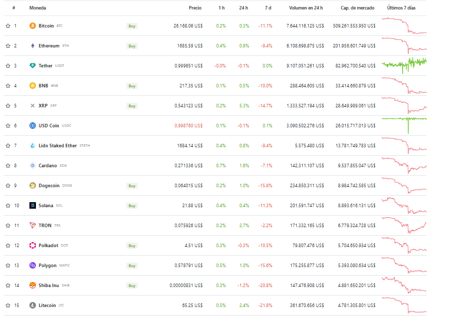
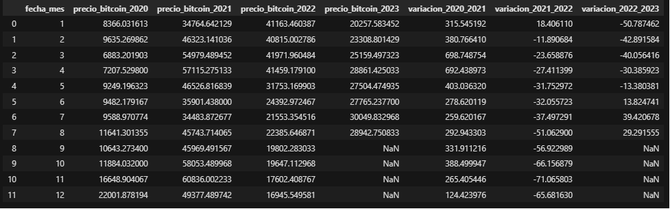
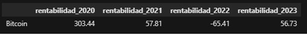
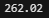

<h1 align=center>PROYECTO INDIVIDUAL Nº2</h1>
<h2 style="color:red"><strong>
Cryptocurrency Market Data Analytics
</strong></h1>
    

Este proyecto es desarrollado por un Analista de Datos que trabaja para una empresa de servicios financieros 
    interesada en el mercado de criptomonedas debido a su crecimiento exponencial y el potencial de oportunidades de inversión para los clientes.
     Así que, en el presente se realiza un análisis exhaustivo (EDA - Exploratory Data Analysis) de 10 criptomonedas, utilizando datos de 
     la <a href="https://www.coingecko.com/en/api/documentation">API CoinGecko</a>, y presenta las respectivas conclusiones 
     de cada una de ellas.

     

Es importante aclarar que para el análisis se usó como datos o variables criptográficas: precio de la moneda, 
    capitalización de mercado y volumen total de transacciones. Esto en un rango de fechas que va desde el 01/01/2020 hasta 18/08/2023.

Se eligieron 10 criptomonedas situadas en el top 15 de precios, según la capitalización de mercado, mostradas en la página de Coingecko 
     el día 18 de agosto del año 2023. Estas son: 'Bitcoin', 'Ethereum', 'Binancecoin (BNB)', 'Ripple (XRP)', 'Cardano', 'Dogecoin', 'Solana', 
     'Polkadot', 'Matic-Network (Polygon)' y 'Litecoin'. Todas ellas son conocidas y bien ponderadas por varios expertos en criptomonedas, 
     quienes además concuerdan en que algunas de estas poseen un potencial real de generar rendimientos en el segundo semestre del presente año.

     

Aquí están algunos enlaces de donde se extrajo la información:
    
<a href="https://www.businessinsider.es/cripto/criptomonedas-con-mas-potencial">Criptomonedas-con-mas-potencial</a>

    
<a href="https://www.plus500.com/es/Trading/CryptoCurrencies/What-are-the-Most-Traded-Cryptocurrencies~2#:~:text=Adem%C3%A1s%20de%20Bitcoin%20y%20Ethereum,y%20popularidad%20tienden%20a%20fluctuar">Criptomonedas-mas-tradeadas</a>

<h3><strong>EDA (Exploratory Data Analysis)</strong></h3>

El servicio o endpoint de la API que se eligió fue: '/coins/{id}/market_chart/range', 
    el cual permite obtener datos de mercado históricos como el precio (prices), la capitalización de mercado (market caps) 
    y el volumen cada 24 horas (total volumes) dentro de un rango de tiempo especificado. En este endpoint los parámetros obligatorios son: 'id' o 
    identificador de la moneda, 'vs_currency' que es la moneda en la que se desea ver los datos de mercado de la cripto, 'from_timestamp' y 'to_timestamp' 
    que representan el rango de fechas (inicio y final, respectivamente) en el cual se desea obtener los datos (deben estar en formato UNIX); y como parámetro 
    opcional está 'precision' que indica el número de decimales que se desea tener en los datos.

Como el servicio de la API trae los datos de una manera no tan amistosa, para nuestro caso, se creó una función que 
resuelva el problema y genere un dataframe deseado.

Cabe aclarar que aunque la columna 'market_caps' es un indicador del dominio y la popularidad de las criptomonedas no se 
    analizó directamente puesto que es producto del precio y el suministro circulante, es decir, está estrechamente ligada al precio
    (columna que sí se estudiará). Además de analizar las columnas mencionadas anteriormente, también se estudió el precio de las criptomonedas cada año.

    

Así pues, se procedió a hacer uso de las funciones, gráficas, correlaciones, mapas de calor y boxplots pertinentes 
    para hacer el análisis de los datos y llegar a las conclusiones necesarias para la toma de decisiones.

<h3><strong>Conclusiones</strong></h3>

<ol>

<li>Todas las criptomonedas tienen una alta volatilidad en cuanto al precio pues su desviación estándar es alta con respecto a la media; en algunas monedas estas 2 métricas suelen tener valores muy cercanos, inclusive se encontraron desviaciones estándar mayores que la media.</li>

<li>Todas las criptomonedas han aumentado de precio si se le compara el que tenían a inicios del año 2020 con el precio actual, desde luego, unas en mayor proporción que otras.</li>

<li>Los precios máximos de todas las criptomonedas se dieron en el año 2021. Se destaca el hecho de que la fecha del `Bitcoin` y Ethereum` fue la misma (08 de noviembre).</li>

<li>Las asociaciones o correlaciones lineales más altas de precios se dan entre `Ethereum` y `BNB` (de 0.94), y `Bitcoin` con `Polkadot` (de 0.93). Además, existe una asociación muy alta de todas las criptomonedas con `Ethereum` y `Bitcoin`. Con el primero de ellos especialmente el `BNB` (0.94) y el mismo `Bitcoin` (0.89), y con el segundo, el `Polkadot` (0.93), `Ethereum` y `Litecoin` (0.89).</li>

<li>En el año 2020 y 2021, todas las monedas aumentaron su precio si se compara el inicio del año con el final. Caso contrario ocurrió en el 2022, donde el precio de todas disminuyó. Y en lo que va de transcurrido este año, no todas las monedas han mantenido el mismo comportamiento, pues se observó una tendencia alcista muy notable del `Bitcoin` y `Ethereum`, en especial cada 3 meses (marzo y junio) luego de bajar un poco su precio (efecto rebote), el `BNB` y `Polygon` tienen tendencia bajista, `Ripple` (`XRP`) ha tenido una ligera tendecia alcista y las demás criptomendas han estado más estables o con tendecia lateral.</li>

<li> En cuanto a los volúmenes de transacciones, se observó que existen diferentes tipos de correlaciones: positivas altas, nulas y negativas. Las positivas altas fueron entre `Polkadot` y `Cardano`, y el `Bitcoin` con el `Ethereum`. En cuanto a las asociaciónes casi nulas, todas se dieron con la criptomoneda `Solana`, incluyendo la relación negativa con `Litecoin`. Por otra parte, los volúmenes máximos de todas las monedas se dieron en el año 2021.</li>

</ol>

<h3><strong>KPI's</strong></h3>

A continuación, se sugieren 3 KPIs relacionados con el análisis realizado anteriormente. Como se analizó que 
    existe una asociación muy alta de todas las criptomonedas con el `Bitcoin` entonces los KPIs están planteados para él. Por lo tanto, 
    se usa el mismo dataframe del estudio de precios pero anexándole una nueva columna llamada 'fecha_mes' que es la extracción del mes de 
    la columna 'fecha' con el fin de usar este como filtro de los KPIs.

<ol>
<li><mark>El primer KPI</mark> muestra la variación porcentual del `Bitcoin` cada mes del año con respecto al mismo mes del año anterior. 
    Con ello se puede decidir si hay algún mes en específico que sea más rentable para invertir.</li>

<li><mark>El segundo KPI</mark> muestra la rentabilidad o rendimiento del `Bitcoin` por cada cada año. Para ello se toma el precio con que 
    inició el año (01 de enero) y se compara con el precio con el cual cerró el año (31 de diciembre). Los valores son porcentuales y 
    cuando el valor es positivo indica que el precio aumentó y cuando el valor es negativo indica que bajó, como fue el caso del año 2022.</li>

<li><mark>El tercer KPI</mark> muestra la rentabilidad o rendimiento procentual del `Bitcoin` desde el 2020 hasta la presente fecha. Para ello se 
    tomó el precio con que inició el año 2020 (01 de enero) y se compara con el precio actual (18 de agosto de 2023).</li>

</ol>